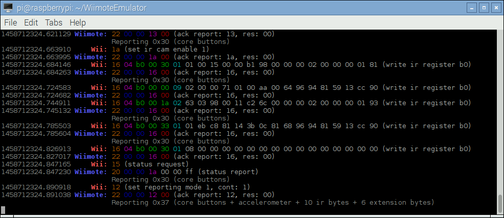

# Wiimote Emulator

Emulates a Bluetooth Wii controller in software.

## Why?

  - Useful for building portable console mods with internal controllers
  - Could theoretically be used for extra controllers (WIP)
  - Can emulate all of the Wiimote's many features and extensions
  - Allows use of different input devices (keyboard etc.)
  - For the fun/hell of it

## How?

### Build/Install

The following dependencies/packages are required:

  - libdbus-1-dev
  - libglib2.0-dev
  - libsdl1.2-dev

Additionally, bluez-4.101 is required (newer versions currently don't work).

To build the emulator, run the makefile in the source directory. In order to
connect to the Wii, a plugin must be installed that allows pairing using non
UTF-8 pin codes. Copy the contents of the bluez-plugin folder to the
bluez-4.101/plugins folder of the Bluez source and run the makefile in that
directory. Copy the output wmemu.so file to the Bluez installation's plugins
directory (e.g. /usr/lib/bluetooth/plugins) and restart the bluetooth service.

TODO: Friendlier directions for different distros/targets, prebuilt binaries

### Step 1: Determine Wiimote Address

As of now, it is not possible to emulate an arbitrary Wiimote due to the Wii's
fussiness when connecting. So you'll need to determine both the Bluetooth
addresses of a Wii and a Wiimote in order to connect.

There are lots of ways to find the address of a Wiimote. Below are the steps
for one method.
  - use hcitool to search for discoverable devices

        > hcitool scan

  - press the red sync button under the battery cover of the Wiimote
  - the Wiimote should be listed (Nintendo RVL-CNT-01) with its address

### Step 2: Determine Wii Address

Finding a Wii's address is a bit trickier. There are multiple ways to do this
as well, including using a Bluetooth packet sniffer or using a utility via
custom firmware on the Wii. Below is a quicker (although messier) way.

  - change your Bluetooth address to the Wiimote's (you'll need to do this anyway)

        > sudo ./bdaddr <wiimote address (from part 1)>

  - reset your adapter to apply the changes

        > sudo hciconfig hci0 reset

  - run the hcidump utility (you may need to download) (any BT activity monitor
    can be substituted)

        > hcidump

  - press the red sync button on the Wii
  - press the red sync button on the Wiimote and after the status LEDs on the
    Wiimote blink 1-5 times, disconnect one of the batteries
  - if done correctly (with a bit of luck) the Wii will connect to your device,
    revealing its address
  - this may take few tries -- note that you must press both sync buttons again
    each time

### Step 3: Run the Emulator

Once you have determined the address of a Wii and Wiimote, you can run the
emulator and it will automatically connect to the Wii. As long as the Wiimote
and the Wii are synced, you will no longer need the physical Wiimote. Though
due to using its Bluetooth address, you will not be able to connect it to the
Wii simultaneously with the emulator. Run the following from the WiimoteEmulator
directory and replace the zeros with your Wii's address.

    > ./wmemulator 00:00:00:00:00:00

You will need your Bluetooth address to be the Wiimote's address every time you
run the emulator. Note that your adapter may reset to the original address when
you restart your PC, etc.

In the event that a mishap or bug in the emulator causes your Wii to block
you from connecting, you will need to sync the original controller again to
regain its trust. You will also need to clear the stored link key using
test-device (included with Bluez).

    > (somewhere)/bluez-4.101/test/test-device remove <wii address>

### Other Tools

**bdaddr**

A redist of the bdaddr utility for Bluez. Might build into some tools, but
ideally in a future version address spoofing won't be needed anymore.

**packedtest**

Simple utility for verifying the behavior of packed structs in your
environment. Might be useful for portability checking.

**sdptool**

Not useful for anything right now. Part of ongoing work to try to get the Wii
to sync directly with the emulator. Running this tool creates the Wiimote's
SDP records, which are vital to the Wii's initial sync process (but not used
after pairing).

**wiimitm**

Connects to a Wiimote and a Wii at the same time to eavesdrop on their
communications. All packets sent between the console and controller are
printed in readable format. Useful for debugging, reverse engineering,
or entertaining one's curiosity.
(TODO: Add this to the repo)
